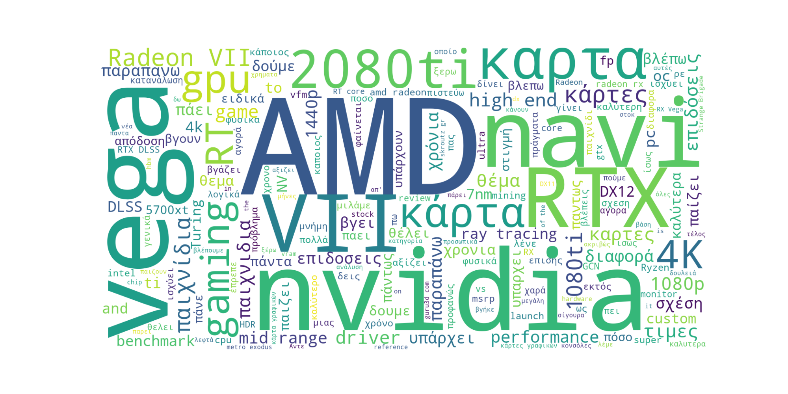
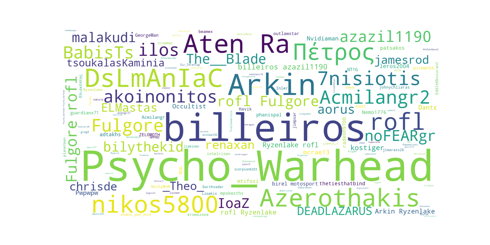
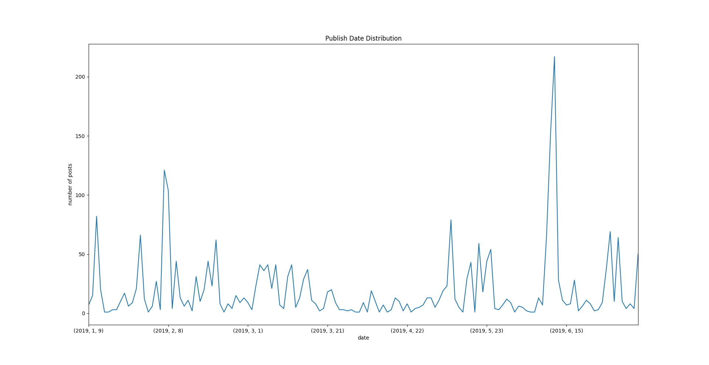
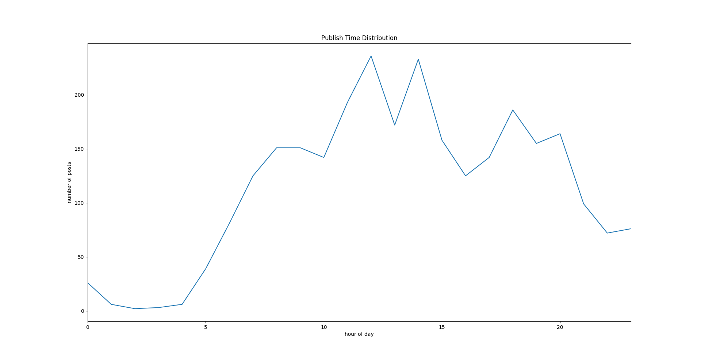

## Description

The purpose of this task was to design a procedure to extract the content from two threads of the https://www.insomnia.gr/ forum and export the harvested data and perform any kind of natural language processing or statistical analysis on the acquired dataset.

## Used Tools/Technologies
 * `requests`
 * `pandas`
 * `WordCloud`
 * `matplotlib`

## Instructions
```bash
pip install -r requirements.txt
python scrapper.py
```

## Implementation

### Part-1.

The first thing I decided to do, was to search and find a way to collect the data I needed from the two threads of the https://www.insomnia.gr/ forum. After some research on the web and specifically on GitHub, I chose to use the two Python libraries: `requests` and `BeautifulSoup`. At first, I scrapped the URLs with the `requests` library, and then I extracted the data of the given URLs with the use of `BeautifulSoup`. Since I was asked to create a dataset with the messages, the usernames and the timestamps of the threads, I used the Mozilla Firefox Inspector tool to find the exact point of DOM I should select to find what was required. What I found was that the data I was looking for were inside an `article` class. More specifically, the attributes I searched for comments were `{"data-role" : "commentContent"}`, for usernames were `{"class": "ipsType_break"}` and for timestamps was `{'datetime'}`. Using a loop from the first to the last page of every thread, I stored all those values to a Python Dictionary with the labels `text`, `username` and `timestamp`. And finally I extracted this dictionary to a `JSON` file so I could easier manipulate my dataset.

The above procedure is on the `scrapper.py` file.

### Part-2.

In the second part, a NLP or statistical analysis should be done on the dataset I had scrapped from the first part. At first, I searched for some modules and techniques to perform statistical analysis on the dataset. I thought about an analysis that would show the most used words in the users’ messages and the users who had participated most in those two forum threads, so I decided to use the WordCloud module. For the creation of a wordcloud, I had to insert from my `JSON` file the exact data I wanted to use into a python list and then convert this list to a string type variable. Subsequently, I passed the file `gr_stopwords.txt` which contains the words I did not want to appear in my statistical analysis and I set it as `STOPWORDS` in the WordCloud.

The first WordCloud I created shows the words that appear most in the users’ comments:



The second WordCloud I created shows the users that had participated in high frequency in the two threads of the forum:



Then I thought about doing some analysis on the timestamps I had scrapped. The ideas that came to my mind were, at first, using the date of each users’ message, to create a timetable that will show the number of messages posted from the day the thread opened since today. And secondly, using the time that each message was posted, I decided to create another timetable that would show the hours of the day that users were more active. After some more research, I found out that I could use the pandas DataFrames to do the above statistical analysis, because I could easilly group the timestamps based on day, month, year and time of the day.

The messages’ publish date analysis from the day that the threads were created:



The activity of the threads during the day:



The above procedure is on the `analysis.py` file.
_*notice: in order to reproduce the above visualizations, each codeblock on analysis.py should be executed
separated in a live ipython console._

## Author

Christou Christos [christos.r.christou@gmail.com](mailto:christos.r.christou@gmail.com)
